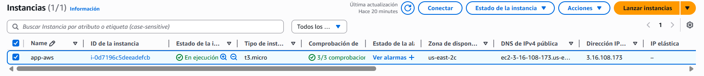
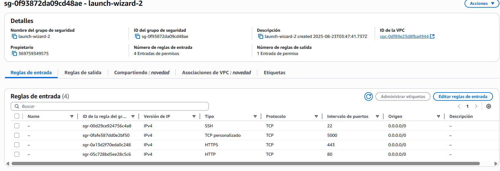
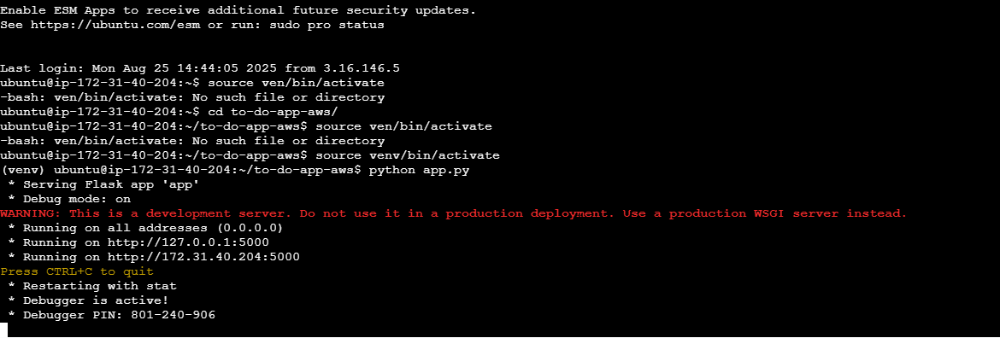
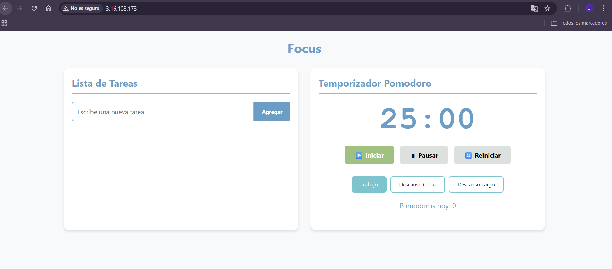
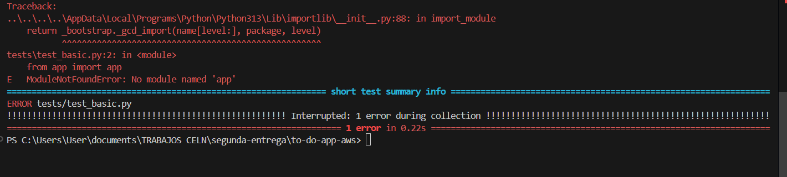

plicación To-Do List y Pomodoro en Flask Desplegada en AWS EC2
🚀 Propósito

Esta es una aplicación desarrollada en Flask (Python) con frontend en HTML, CSS y JavaScript. El propósito de la aplicación es:

👉 To-Do List: Manejar un CRUD con tareas o pendientes en el día a día.
👉 Pomodoro: Implementar la técnica Pomodoro para realizar tareas con intervalos de concentración y descanso equilibrados.

La aplicación está desplegada en AWS EC2 (Ubuntu, Free Tier) y es accesible públicamente a través del navegador.

⚙️ Tecnologías Utilizadas

AWS EC2 (Ubuntu 22.04 LTS, Free Tier)

EC2 Instance Connect

Flask (Python 3.x)

HTML, CSS, JavaScript

Nginx (como proxy reverso para exponer la app Flask)

🌍 URL de la Aplicación

La aplicación está disponible en:
http://3.16.108.173/

📋 Requisitos Previos

Para replicar este despliegue se necesita:

Cuenta en AWS Free Tier

Una instancia EC2 Ubuntu Server 22.04 corriendo en AWS

Configuración de Security Groups con los siguientes puertos abiertos:

22 → (SSH/EC2 Instance Connect)

80 → (HTTP, acceso público con Nginx)

5000 → (Puerto interno para Flask, si se ejecuta directamente sin Nginx)

5. Paso a Paso del Despliegue
5.1 Crear Instancia EC2

Ingresar a AWS → EC2 → Launch Instance

Configuración:

AMI: Ubuntu Server 22.04 LTS (Free Tier)

Tipo de instancia: t3.micro (Free Tier)

Almacenamiento: 8 GB

Security Group: abrir puertos 22, 80 y 5000.

Lanzar la instancia.

5.2 Conexión con EC2 Instance Connect

Seleccionar la instancia en AWS EC2.

Clic en Connect → EC2 Instance Connect.
Esto nos abrirá una terminal en el navegador.

5.3 Instalar Dependencias en la Instancia

Ejecuta los siguientes comandos:
```
# Actualizar paquetes
sudo apt update && sudo apt upgrade -y

# Instalar Python y pip
sudo apt install python3 python3-pip -y

# Instalar Flask
pip3 install flask

# Instalar Nginx
sudo apt install nginx -y
```
5.4 Clonar el Repositorio con la Aplicación
```
git clone https://github.com/<usuario>/mi-proyecto-aws.git
cd mi-proyecto-aws/src
```
5.5 Configuración de Flask

Asegúrate de que tu app.py tenga lo siguiente en la parte final:
```
if __name__ == "__main__":
    app.run(host="0.0.0.0", port=5000)

# Ejecutar la aplicación:

python3 app.py
```


Verificar que funciona abriendo en navegador:


`http://<IP_PÚBLICA>:5000`

5.6 Configuración de Nginx como Proxy Reverso

Editar la configuración de Nginx:

`sudo nano /etc/nginx/sites-available/default`


Reemplazar el bloque location / { ... } por:
```
location / {
    proxy_pass http://127.0.0.1:5000;
    proxy_set_header Host $host;
    proxy_set_header X-Real-IP $remote_addr;
    proxy_set_header X-Forwarded-For $proxy_add_x_forwarded_for;
    proxy_set_header X-Forwarded-Proto $scheme;
}
```

Probar y reiniciar Nginx:
```
sudo nginx -t
sudo systemctl restart nginx
```

Ahora la aplicación Flask estará disponible en:

`http://<IP_PÚBLICA>`

📷 6. Capturas de Pantalla





🐞 7. Problemas Encontrados y Soluciones
⚠️ Problema: Página de Nginx en lugar de mi aplicación Flask

Cuando abría 

`http://3.16.108.173/` 

aparecía la página por defecto de Nginx en vez de mi aplicación Flask.

Causa: Nginx estaba sirviendo su propia página inicial en /var/www/html/index.nginx-debian.html.

✅ Solución:

Configuré Nginx como proxy reverso para redirigir al puerto 5000 donde corre Flask.

Reinicié Nginx y la aplicación Flask se mostró correctamente.

8. Consejos 

Usar host="0.0.0.0" en Flask para exponer la aplicación.

Siempre probar los puertos en Security Groups antes de depurar errores.

Nginx facilita exponer la aplicación en el puerto 80, en lugar de usar directamente el 5000.

Documentar errores encontrados para futuras implementaciones.

👨‍🏫 9. Reflexión y Aprendizajes

Aprendí a desplegar una aplicación Flask en AWS EC2 usando EC2 Instance Connect.

Comprendí cómo funciona Nginx como proxy reverso.

Verifiqué la importancia de abrir correctamente los puertos de Security Group.

Este proceso me ayudó a mejorar mis habilidades en despliegue en la nube.
                                                
⚙️ 10. Automatización con GitHub Actions

Para mejorar el flujo de desarrollo y validar la aplicación automáticamente en cada push al repositorio, se configuró un workflow básico con **GitHub Actions**.

✅ Este workflow realiza:
- Instalación de dependencias desde `requirements.txt`
- Ejecución de tests con **pytest** en la carpeta `tests/`
- Verificación automática en cada push a la rama `main`


---

🧪 10.1 Test Implementados

Se agregó un archivo `tests/test_basic.py` con validaciones mínimas:

```python
import pytest
from app import app

def test_basic_math():
    assert 1 + 1 == 2

def test_home_page():
    client = app.test_client()
    response = client.get('/')
    assert response.status_code == 200
    assert b"Welcome" in response.data  # Ajusta según tu HTML`
```

📛 10.2 Error hallando el App.py

Al implementar la informacion compartida por el docente, e implementar la ejecucion del test compartido, vemos que tenemos algunos errores, y el nuestro, en esta ocasión, fue la ruta de la apliacion principal "app.py", recibiendo un error: 



✔️ 10.2 Solución
Este error nos dice que debemos implementar algunas mejoras o correcciones en la importación, ya que nuestro test no esta reconociendo o encontrando el fichero app.py o app, por lo tanto, agregamos algunas lineas en el test para decirle a nuestro test, que de manera forzada, debe buscar en la raiz de nuestro directorio, asi que implementamos estas lineas al principio de nuestro test: 
📛 Antes:
```
from app import app
```

✔️ Ahora:
```
import pytest
import sys
import os
sys.path.append(os.path.dirname(os.path.dirname(os.path.abspath(__file__))))

from app import app
```

📛 10.3 Error en la estructura del test

Al haber arreglado nuestro error, podemos ver que al ejecutar nuestro pytest, vemos otro error 


Aqui, vemos que al implementar el codigo compartido por el profesor, tenemos un error, en este caso, es:
