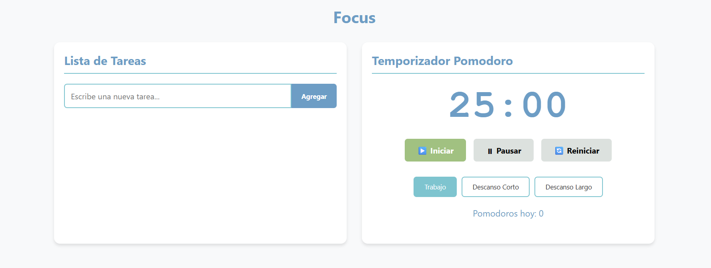
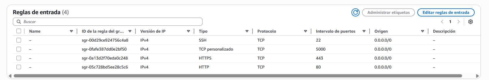

📌 1. Descripción General de la Aplicación

Esta es una aplicación desarrollada en Flask (Python) con frontend en HTML, CSS y JavaScript.
El propósito de la aplicación es:
👉 Manejar una implementacion entre dos funcionalidades que esten relacionadas, en nuestro caso, creamos una lista en programación conocida como "to-do list" y es para realizar un crud con tareas o pendientes en nuestro dia a dia, ademas, por su lado, tenemos un pomodoro, el cual es un medio para ejercer una tarea con orden, estableciendo la intensidad y el descanso de una manera equitativa.

La aplicación está desplegada en AWS EC2 (Ubuntu, Free Tier) y es accesible públicamente mediante el navegador.

⚙️ 2. Tecnologías Utilizadas

AWS EC2 (Ubuntu 22.04 LTS, Free Tier)

EC2 Instance Connect 

Flask (Python 3.x)

HTML, CSS, JavaScript

Nginx (como proxy reverso para exponer la app Flask)

🌍 3. URL de la Aplicación

La aplicación está disponible en:

http://3.16.108.173/

📋 4. Requisitos Previos

Para replicar este despliegue se necesita:

Cuenta en AWS Free Tier

Una instancia EC2 Ubuntu Server 22.04 corriendo en AWS

Configuración de Security Groups con los siguientes puertos abiertos:

22 → (SSH/EC2 Instance Connect)

80 → (HTTP, acceso público con Nginx)

5000 → (Puerto interno para Flask, si se ejecuta directamente sin Nginx)

5. Paso a Paso del Despliegue
5.1 Crear Instancia EC2

Ingresar a AWS → EC2 → Launch Instance

Configuración:

AMI: Ubuntu Server 22.04 LTS (Free Tier)

Tipo de instancia: t3.micro (Free Tier)

Almacenamiento: 8 GB

Security Group: abrir puertos 22, 80 y 5000.

Lanzar instancia.

5.2 Conexión con EC2 Instance Connect

Seleccionar la instancia en AWS EC2

Clic en Connect = EC2 Instance Connect

Esto nos abre una terminal en el navegador.

5.3 Instalar Dependencias en la Instancia
# Actualizar paquetes
sudo apt update && sudo apt upgrade -y

# Instalar Python y pip
sudo apt install python3 python3-pip -y

# Instalar Flask
pip3 install flask

# Instalar Nginx
sudo apt install nginx -y

5.4 Clonar el Repositorio con la Aplicación
git clone https://github.com/<usuario>/mi-proyecto-aws.git
cd mi-proyecto-aws/src

5.5 Configuración de Flask

Asegúrate de que tu app.py tenga lo siguiente en la parte final:

if __name__ == "__main__":
    app.run(host="0.0.0.0", port=5000)

    Ejecutar la aplicación:

python3 app.py

Verificar que funciona abriendo en navegador:

http://<IP_PÚBLICA>:5000

5.6 Configuración de Nginx como Proxy Reverso

Editar la configuración de Nginx:

sudo nano /etc/nginx/sites-available/default

Reemplazar el bloque location / { ... } por:

location / {
    proxy_pass http://127.0.0.1:5000;
    proxy_set_header Host $host;
    proxy_set_header X-Real-IP $remote_addr;
    proxy_set_header X-Forwarded-For $proxy_add_x_forwarded_for;
    proxy_set_header X-Forwarded-Proto $scheme;
}

Probar y reiniciar Nginx:

sudo nginx -t
sudo systemctl restart nginx

Ahora la aplicación Flask estará disponible en:

http://<IP_PÚBLICA>

📷 6. Capturas de Pantalla

🐞 7. Problemas Encontrados y Soluciones
⚠️ Problema: Página de Nginx en lugar de mi aplicación Flask

Cuando abría http://<IP_PÚBLICA>, aparecía la página por defecto de Nginx en vez de mi aplicación Flask.

Causa: Nginx estaba sirviendo su propia página inicial en /var/www/html/index.nginx-debian.html.

✅ Solución:

Configuré Nginx como proxy reverso para redirigir al puerto 5000 donde corre Flask.

Reinicié Nginx y la aplicación Flask se mostró correctamente.